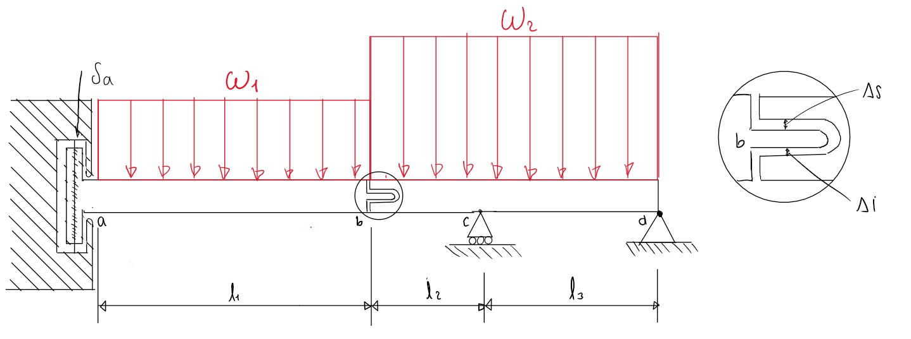

# PROYECTO RESISTENCIA DE MATERIALES

Se presenta el programa, que permite dar respuesta a un problema de resistencia de materiales: una viga que consta de dos secciones, acopladas en **b** mediante una junta especial que permite un recorrido vertical relativo entre los extremos, Δs y Δi hacia arriba y hacia abajo respectivamente.

## Análisis

Para el análisis de este problema, se opta por analizar cada tramo de la viga por aparte, asumiendo que no hay contacto en **b**, se halla el desplazamiento en **b** para cada viga mediante la ecuación universal de la curva elástica, y se presentan los resultados en la tabla resumen.

Cada viga se analiza de la siguiente manera:

- **Viga AB**: se analiza como viga empotrada en **a** y con voladizo en **b**.
- **Viga BD**: se analiza como viga con voladizo en **b**, con rodillo en **c** y fija en **d**.



Este análisis, permite añadir las fuerzas a acople a cada viga, por lo tanto, luego se vuelve a analizar cada viga, pero ahora teniendo en cuenta las fuerzas de acople, lo cual lleva a un sistema de ecuaciones 7x7. Como se analizan tres casos distintos de asentamiento en a, el sistema para los casos donde ya es 0, 10 y -10 mm es:


$$
1.\quad A\frac{l_1^3}{6} - M_a\frac{l_1^2}{2} - Y_1EI_{\text{izq}} = \frac{w_1 l_1^4}{24} - EI_{\text{izq}} Y_o
$$

$$
2.\quad D\frac{l_4^3}{6} + C\frac{l_2^3}{6} - Y_2EI_{\text{der}} = \frac{w_2 l_4^4}{24} - EI_{\text{der}} t l_4
$$

$$
3.\quad A + P = w_1 l_1
$$

$$
4.\quad M_a + P l_1 = \frac{w_1 l_1^2}{2}
$$

$$
5.\quad D + C - P = w_1 l_4
$$

$$
6.\quad P l_4 - C l_3 = -\frac{w_2 l_4^2}{2}
$$

$$
7.\quad Y_1 = Y_2 + \delta
$$

Luego de resolver este sistema, también usando código (su resolución se encuentra en los archivos `analisis_ya_0.py`, `analisis_ya_10.py` y `analisis_ya_-10.py`), ahora sí se tienen las reacciones de las vigas y es posible realizar las graficas de fuerza cortante y momento flector. Lo cual, finalmente cumple con los requisitos y objetivos del código: 
- obtener las reacciones en los apoyos A, C y D y la reacción en el acoplamiento especial.
- obtener los diagramas de fuerza cortante (V) y momento flector (Mf).
- presentar una tabla resumen donde muestre los valores críticos de V y Mf, y su ubicación.
- presentar una tabla resumen donde se muestre la deflexión, en milímetros, y la inclinación, en grados.

## Implementación

El programa, desarrollado en Python, incluye:
- cálculo de desplazamientos en **b** para ambas vigas.
- cálculo de reacciones mediantes resolución de sistema de ecuaciones
- generación y exportación de diagramas de cortante y momento flector.
- exportación de resumenes de resultados en tablas.

Además, en este respositorio se incluyen las gráficas y tablas para delta a = 0, como ejemplo. Si desea ver las demás implementaciones, corra el código y seleccione los otros valores posibles de delta a.

Si desea, para una implementación más fácil y rápida, puede abrir este mismo proyeccto y ejecutarlo en Colab:

[Abrir en Colab](https://colab.research.google.com/drive/1zl6dZ-tgf0FJcgcUkKOuioLuBHJm8iQ_?usp=sharing)


Donde solo tiene que presionar el botón `Ejecutar todas`, dirigirse a la parte de abajo en la ventana donde le preguntarán qué valor de delta a desea.

## Requisitos

- Python 3.8+
- Bibliotecas:
  - `numpy`
  - `matplotlib`
  - `pandas` (opcional para tablas)
  - `tabulate` (opcional para visualización elegante en consola)
 
## Ejecución

 Para ejecutar el programa principal:

```bash
python main.py
  
